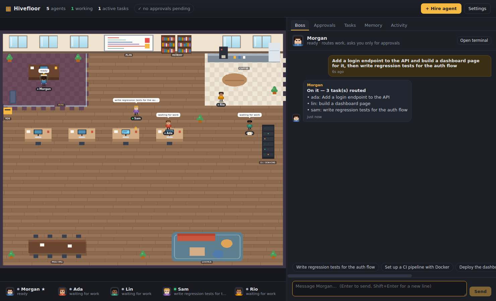

# Hivefloor

A local-first desktop office for AI coding agents. Each agent runs a real CLI in its own terminal. You can watch them walk around the floor, message each other, remember things between sessions, and pick up work from one boss agent. The boss is the only agent you talk to, and it only asks you when something needs approval: spending money, deleting things, big or irreversible changes, and messages to people outside.

It's inspired by [munder-difflin](https://github.com/chaitanyagiri/munder-difflin), but the harness was rebuilt with performance as the main goal (see [BENCHMARKS.md](./BENCHMARKS.md)).



## Quick start

```bash
npm install            # node-pty ships N-API prebuilds for macOS/Windows; Linux compiles it (needs make/g++/python3)
npm run dev            # launch the app (hot reload)
npm run demo:headless  # or: run the whole office in your terminal, no Electron
npm test               # 14 tests: core + real-PTY end-to-end
npm run bench          # compare against the reference harness design
npm run dist:mac | dist:win | dist:linux   # installers via electron-builder
```

On first launch, Hivefloor sets up a demo office: **Morgan** (boss), Ada (backend), Lin (frontend), Sam (QA) and Rio (DevOps). They start as scripted demo workers, so you can see everything working without any keys. To make them real, open an agent → **Setup** → Engine, pick Claude Code, Codex, Gemini, Aider, OpenCode or the built-in agent, then **Save & restart**. You can also hire new agents with **+ Hire agent**.

## What you get

| | |
|---|---|
| **Office floor** | A Canvas2D pixel office. Agents walk between their desk, the coffee corner, the whiteboard (plan), the memory shelves, the CI rack and the boss's door (waiting for approval). Envelopes fly between desks when agents message each other. Monitors glow while an agent works. A padlock shows which files an agent has leased. |
| **Real terminals** | Every agent is a real process in a pseudo-terminal (node-pty), shown with xterm.js. You can type straight into any agent's terminal. |
| **Boss routing** | You chat with the boss. It splits each request into tasks and uses `hive route` (BM25 over roles and skills, weighted by who's free) to hand them out. It answers routine questions from agents itself. |
| **Approvals only when needed** | A policy engine flags spend, deletes (`rm -rf`, `DROP TABLE`, force-push…), big changes (publish, prod deploy, pushes to main, large rewrites, over N files) and external messages. Once you approve, the approval is attached to the tasks, so workers aren't asked again. Agents can't reuse an approval that was granted to someone else. |
| **Memory** | Each agent has long-term memory (`hive remember` / `hive recall`), and there's also shared memory. It's saved as an event log plus a readable `memory.md` for each agent, and indexed in-process with BM25 (sub-millisecond at 20k entries). It survives restarts. |
| **No stepping on toes** | File **leases** (prefix-aware: `src/api` conflicts with `src/api/x.ts`), or give each agent its **own git worktree and branch**. Tasks are claimed atomically. A hop cap stops agents from bouncing messages back and forth forever. |
| **Your keys, local models** | Keys are encrypted with your OS keychain (Electron safeStorage) and only passed to agent processes. The built-in agent works with any OpenAI-compatible endpoint (Ollama, LM Studio, vLLM, OpenAI, OpenRouter) or with Anthropic. |
| **Cross-platform** | macOS, Windows and Linux. The `hive` CLI is plain Node, with `sh`, `.cmd` and `.ps1` shims. |

## Architecture

```
 Renderer (React)                         Main process (Electron shell)
 ┌──────────────────────────────┐   IPC   ┌───────────────────────────────────────────┐
 │ Canvas floor · xterm pool    │◄───────►│  Harness (pure Node, src/core)            │
 │ Boss chat · Approvals · Tasks│ 30Hz ev │   ├─ Hive: event-sourced store + WAL      │
 │ Memory · Activity            │ batches │   │   router · tasks · approvals · leases │
 └──────────────────────────────┘         │   ├─ MemoryIndex (BM25)                   │
                                          │   ├─ ApprovalPolicy                       │
                                          │   ├─ PtyManager (frame-batched, ring buf) │
                                          │   └─ ControlServer (127.0.0.1, per-agent  │
                                          │        bearer tokens, long-poll)          │
                                          └──────────────┬────────────────────────────┘
                                                         │ HTTP
                           ┌─────────────────────────────┼──────────────────────────┐
                           │ claude / codex / gemini / aider / opencode / built-in  │
                           │ each in its own PTY, with `hive` on PATH               │
                           └────────────────────────────────────────────────────────┘
```

### Why it's faster than the reference design

| Hot path | Reference (munder-difflin) | Hivefloor |
|---|---|---|
| Message delivery | Agents drop JSON into `outbox/`. A router polls every outbox every **1.5 s**. | Push delivery through an authenticated local RPC, and recipients long-poll, so they wake up right away. **p50 2 ms vs ~775 ms.** |
| Persistence | `git add -A && git commit` via **spawnSync on the main thread** for every message (~100 ms each), with index.lock retries. | Each change is applied in memory and appended to a buffered write-ahead log (**~17 µs**). Snapshots are throttled and replay is snapshot plus the log tail. |
| Terminal streaming | One IPC send per `onData` chunk, for every agent. | One frame-coalesced batch every 16 ms for all agents, **~100× fewer sends**. Terminals that aren't on screen stream nothing and replay from a 512 KB ring buffer when opened. Flow control pauses a runaway PTY. |
| Floor rendering | Pixi.js scene | Cached static layer plus a light dynamic layer. Runs at 60 fps only while something moves, about 8 fps when idle, and stops when the window is hidden. |
| Memory recall | External CLI process per query | In-process incremental BM25, p50 0.25 ms at 20k entries |
| Sender identity | Taken from the outbox directory | Per-agent bearer token, so agents can't impersonate each other or reuse someone else's approval |

## The agent contract

Every agent gets `HIVE_URL`, `HIVE_TOKEN` and `HIVE_AGENT`, the `hive` CLI on its PATH, and an identity prompt (appended as a system prompt for Claude Code, or passed as the first turn for others).

```
hive inbox [--wait 30]                  hive send <agent|boss|human|all> "<subject>" --body "..."
hive remember "<fact>" [--shared]       hive recall "<query>"
hive task new|claim|done|list           hive status working|idle|blocked "<note>"
hive lease <paths…> / hive release      hive check "<command>" [--task id]
hive ask <spend|delete|big-change|external> "<summary>" [--wait 600]
hive route "<task>"                     hive board [--append "..."]
```

Claude Code also gets a `Stop` hook (`hive hook stop`) that keeps it working while it has unread mail. Other CLIs get a short nudge typed into their terminal when mail arrives, but only when they're idle and at most once every 15 s.

## Data

Everything is stored in `~/.hivefloor` (change it with `HIVEFLOOR_HOME`):

```
hive/events.jsonl       append-only log of every change (audit trail)
hive/state.json         snapshot (throttled)
hive/agents/<id>/memory.md, identity.md
settings.json           model endpoint, policy, encrypted keys
worktrees/<id>          per-agent git worktrees (when isolation = worktree)
bin/hive(.cmd/.ps1)     CLI shims
```

## Engines

| Engine | Needs |
|---|---|
| Demo worker | nothing (scripted, but it goes through the full harness) |
| Built-in agent | an OpenAI-compatible endpoint (Ollama by default at `localhost:11434/v1`) or an Anthropic key |
| Claude Code | `claude` on PATH, plus a subscription or `ANTHROPIC_API_KEY` |
| Codex | `codex` on PATH, plus ChatGPT or `OPENAI_API_KEY` |
| Gemini CLI | `gemini` on PATH |
| Aider, OpenCode | the CLI on PATH |
| Custom / shell | any command |
